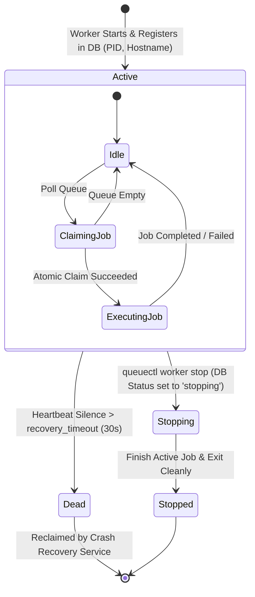
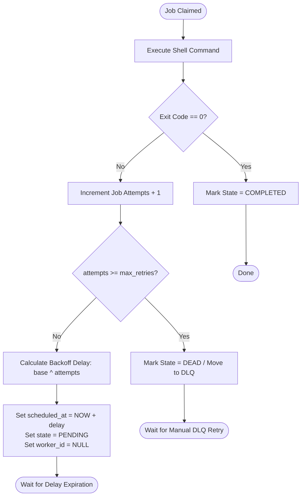
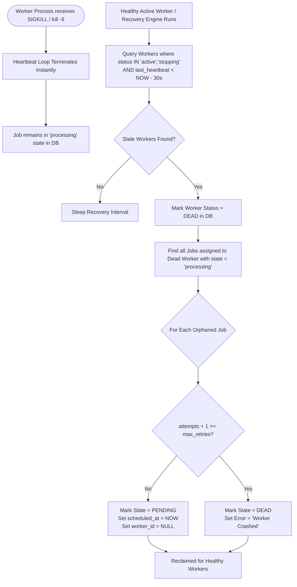
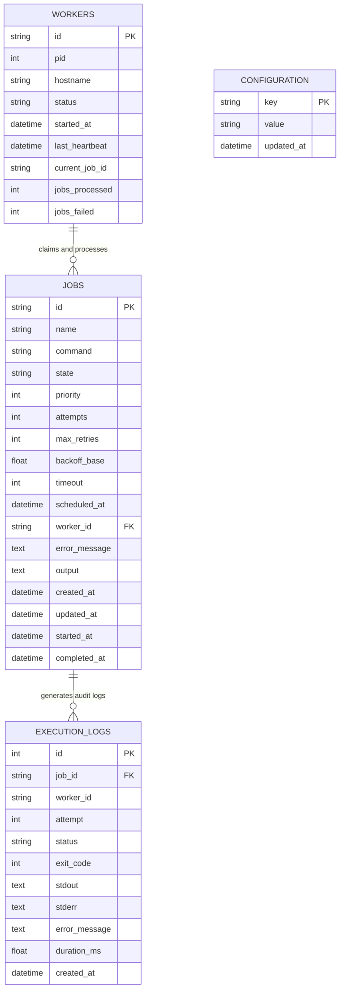

# QueueCTL - System Architecture & Diagrams (ARCHITECTURE.md)

This document provides formal architectural models and visual sequence diagrams for **QueueCTL** created using Mermaid syntax.

---

## 1. System Component Diagram

```mermaid
graph TD
    subgraph CLI Layer
        CLI_Main["queuectl CLI (Typer)"]
        Cmd_Enqueue["queuectl enqueue"]
        Cmd_Worker["queuectl worker start/stop"]
        Cmd_Status["queuectl status / list"]
        Cmd_DLQ["queuectl dlq list/retry"]
    end

    subgraph Service & Core Layer
        QueueSvc["QueueService"]
        WorkerSvc["WorkerService"]
        RecoverySvc["CrashRecoveryService"]
        ConfigSvc["ConfigService"]
        MetricsSvc["MetricsService"]
        Executor["CommandExecutor (subprocess)"]
    end

    subgraph Persistence Layer (SQLite WAL)
        DB[("queuectl.db (SQLite WAL)")]
        Table_Jobs[("jobs Table")]
        Table_Workers[("workers Table")]
        Table_Config[("configuration Table")]
        Table_Logs[("execution_logs Table")]
    end

    subgraph Web UI Layer
        Dashboard["FastAPI Dashboard (http://localhost:8000)"]
    end

    CLI_Main --> Cmd_Enqueue
    CLI_Main --> Cmd_Worker
    CLI_Main --> Cmd_Status
    CLI_Main --> Cmd_DLQ

    Cmd_Enqueue --> QueueSvc
    Cmd_Worker --> WorkerSvc
    Cmd_Status --> MetricsSvc
    Cmd_DLQ --> QueueSvc

    WorkerSvc --> Executor
    WorkerSvc --> RecoverySvc

    QueueSvc --> DB
    WorkerSvc --> DB
    RecoverySvc --> DB
    MetricsSvc --> DB
    ConfigSvc --> DB

    Dashboard --> MetricsSvc
    Dashboard --> QueueSvc

    DB --> Table_Jobs
    DB --> Table_Workers
    DB --> Table_Config
    DB --> Table_Logs
```

---

## 2. Job Execution Sequence Diagram

```mermaid
sequenceDiagram
    autonumber
    actor User
    participant CLI as queuectl CLI
    participant QueueSrv as QueueService
    participant DB as SQLite DB (WAL)
    participant Worker as Worker Process
    participant Subproc as Subprocess Executor

    User->>CLI: queuectl enqueue --name "Backup" --command "tar -czf backup.tgz /data"
    CLI->>QueueSrv: enqueue(JobCreate)
    QueueSrv->>DB: INSERT INTO jobs (state='pending', priority=0)
    DB-->>QueueSrv: Job Created (ID: uuid)
    QueueSrv-->>CLI: Return Job Data
    CLI-->>User: [OK] Job Enqueued

    loop Worker Execution Loop
        Worker->>DB: BEGIN IMMEDIATE; UPDATE jobs SET state='processing', worker_id=W1 ... RETURNING id
        alt Job Available
            DB-->>Worker: Claimed Job (ID: uuid, command: "tar -czf ...")
            Worker->>Subproc: Popen(command, timeout=60)
            Subproc-->>Worker: Exit Code 0, stdout, stderr
            Worker->>DB: UPDATE jobs SET state='completed', output=stdout
            Worker->>DB: INSERT INTO execution_logs
        else Queue Empty
            DB-->>Worker: 0 rows updated
            Worker->>Worker: Sleep poll_interval (1s)
        end
    end
```

---

## 3. Worker Process Lifecycle State Diagram



---

## 4. Exponential Backoff & Retry Flowchart



---

## 5. SIGKILL Crash Recovery Engine Flowchart



---

## 6. Database Entity-Relationship Diagram (ERD)


